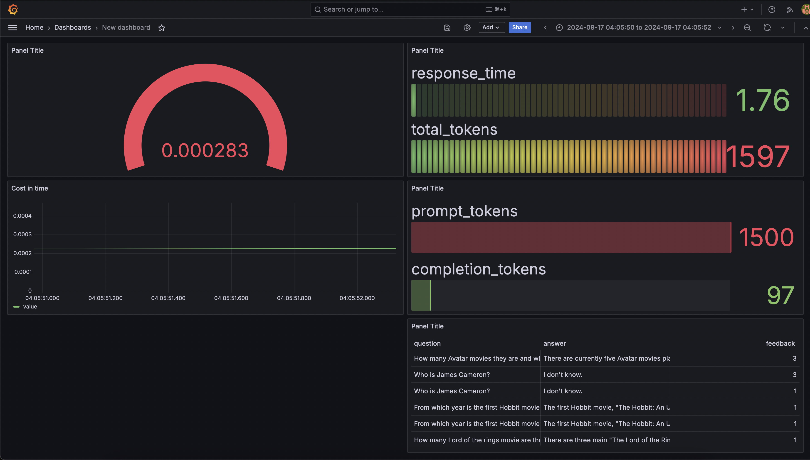

# Movie Assistant

The **Movie Assistant** is an intelligent movie recommendation and information retrieval tool designed to enhance user interaction by leveraging the capabilities of a Large Language Model (LLM). This project is part of the LLM Zoomcamp and demonstrates the use of Retrieval-Augmented Generation (RAG) to provide detailed and contextually relevant movie-related information.

## Key Features

### Extensive Movie Database
The application utilizes a comprehensive dataset sourced from [Kaggle](https://www.kaggle.com/datasets/rajugc/imdb-movies-dataset-based-on-genre/data), which includes detailed information for each movie, such as:

- **Movie Name**: The title of the movie.
- **Year**: The release year of the movie.
- **Runtime**: The duration of the movie in minutes.
- **Genre**: The genre(s) of the movie (e.g., Action, Drama, Comedy).
- **Rating**: The IMDb or similar platform rating.
- **Description**: A brief synopsis of the movie.
- **Director**: The name of the movie's director.
- **Star**: The lead actor or actress in the movie.
- **Votes**: The number of votes or reviews the movie has received.

### Intelligent Movie Assistant
The application leverages RAG to provide users with accurate and context-sensitive responses to queries related to movies. Whether a user is looking for a movie recommendation based on a particular genre, seeking information about a director’s filmography, or wanting to know the success of a movie, the assistant can retrieve and generate responses based on the available data.

### Seamless Integration of Retrieval and Generation
The RAG framework combines retrieval-based methods with generative models, ensuring that the responses are both factually accurate and fluently presented. The retrieval component accesses the structured movie data, while the generative model crafts user-friendly responses.

### Enhanced User Experience
With the ability to understand and respond to complex queries, the Movie Assistant RAG Application offers a more personalized and engaging user experience. It not only fetches specific information but can also provide insightful recommendations and comparisons between movies.

---

*Note: The movie dataset used in this project was taken from Kaggle and can be accessed [here](https://www.kaggle.com/datasets/rajugc/imdb-movies-dataset-based-on-genre/data).*

### Project Structure

- **Dockerfile**: Contains the instructions to build the Docker image for the application.
- **README.md**: Provides an overview of the project, its features, and instructions for setup and usage.
- **app.py**: The main application script that runs the Movie Assistant. It uses streamlit to create a web interface.
- **config**: Directory containing configuration files for Grafana dashboards and data sources.
    - **grafana_dashboards.yaml**: Configuration for Grafana dashboards.
    - **grafana_datasources.yaml**: Configuration for Grafana data sources.
- **dashboards**: Directory for storing Grafana dashboard JSON file.
- **data**: Directory for storing the movie dataset.
    - **movies.csv**: The CSV file containing the movie dataset.
- **img**: Directory for storing images used in the README.
- **docker-compose.yml**: Configuration file for Docker Compose to set up and run multi-container Docker applications.
- **notebooks**: Directory containing Jupyter notebooks for experiments and data preparation.
    - **experiment.ipynb**: Notebook for running experiments with the data and models. You can find there the whole algorithm step by step. Monitoring was added later on, in py scripts though.
    - **prepare_data.ipynb**: Notebook for preparing and cleaning the movie dataset from Kaggle.
    - **requirements.txt**: List of Python dependencies for the notebooks.
- **requirements.txt**: List of Python dependencies for the main application.
- **scripts**: Directory for storing various scripts.
    - **database**: Subdirectory for database-related scripts.
        - **init-db.sh**: Shell script to initialize the database.
- **src**: Directory containing the source code of the application.
    - **__init__.py**: Initialization file for the source code package.
    - **db.py**: Script for database interactions.
    - **elastic_search.py**: Script for interacting with Elasticsearch.
    - **ingest.py**: Script for ingesting data into the application.
    - **llm.py**: Script for leveraging the Large Language Model.


## Setup and Usage
Before starting go to `.env` file and set the OpenAI API key, so you can run the whole project. It assumes you have access to gpt-4o-mini.
First off, run all the services using docker compose. This will start the Elasticsearch, Postgres db, Grafana and the Movie Assistant services.

```bash
docker-compose up
```

Once the services are up and running, you'll need to ingest the movie data into the application. This can be done by running the following command:

```bash
docker exec movie-assistant-app-1 python src/ingest.py
```

It might take some time, but at the end of the process, the movie data will be ingested into the Elasticsearch index.

From now on you can open your browser and access the Movie Assistant at `http://localhost:8501`.
Grafana can be accessed at `http://localhost:3000` with the following credentials: admin, admin
After running some queries on the Movie Assistant, you can check the logs and metrics on Grafana.
You can load the dashboard configuration by importing the `dashboards/movie-assistant-dashboard.json` file, it contains 5 visualizations to monitor the application, as shown below:

